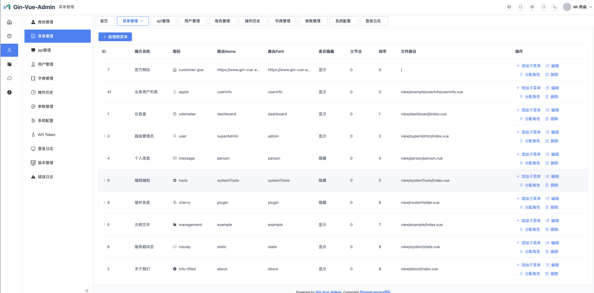

###

## 框架特点

- **自研接口文档系统**：文档扫描与生成核心由项目基于 Go AST（抽象语法树）自行开发，不使用 Swagger/Swag 一类第三方注解扫描生成器。系统会解析 Router 注册信息、请求/响应 DTO 和 Handler 注释，自动输出 OpenAPI JSON；`/api`、`/admin-api` 可分别生成并访问各自的接口文档，Knife4j 只负责前端页面展示。详细说明见 [API 文档专题](docs/api-doc-topic.md)。
- **自带管理后台基础模块**：内置管理员、角色、菜单、API、字典和 Casbin 权限等基础能力，并兼容现有 GinVueAdmin 管理后台。接口约定见 [系统管理接口契约](docs/system-api-contract.md)。
- **Router 自动绑定参数**：泛型 Router 统一完成参数绑定和校验；GET 自动处理 query/path 参数，POST 自动处理 JSON Body，Handler 直接接收强类型请求 DTO。
- **Router 请求策略**：可在注册路由时按需声明限流、Redis 读穿透缓存、写后删除缓存和并发控制（Redis 分布式锁），无需在 Handler 中重复编写样板代码。

## 新手引导

第一次参与本项目开发，建议先看：

- 开发引导与通用规则：[AGENTS.md](AGENTS.md)
- Shop-API 新手引导：[docs/new-developer-guide.md](docs/new-developer-guide.md)
- Codex 极简开发约定：[docs/codex-crud-guide.md](docs/codex-crud-guide.md)
- 常用模块 CRUD 规范：[docs/module-crud-conventions.md](docs/module-crud-conventions.md)
- Shop-API 架构与开发规范：[docs/architecture-dev-guide.md](docs/architecture-dev-guide.md)

## Router 与 Handler 基本写法

前台业务接口使用 `/api`，后台管理接口使用 `/admin-api`，两者不要混用。下面以前台 Article 接口为例。

### Router 示例

Router 负责选择鉴权分组、注册请求方法和路径，并按需挂载缓存、限速或锁等请求策略：

```go
func InitApiRouter(routeRegistry *router.RouteRegistry) *router.RouteRegistry {
	// 需要登录的前台接口。
	apiGroup := routeRegistry.Group("api")
	apiGroup.Use(middleware.ApiAuthTokenRequired())

	// 不需要登录的前台接口。
	noAuthGroup := routeRegistry.Group("api")

	article := &api.Article{}

	// 普通路由：直接注册 Handler。
	router.GET(noAuthGroup, "/article/pageList", article.PageList)

	// 带请求策略的路由：详情按文章 ID 使用 Redis 缓存。
	router.GET(noAuthGroup, "/article/detail", article.Detail, articleModule.DetailOptions...)

	// 需要登录的接口应注册到 apiGroup。
	router.POST(apiGroup, "/article/create", article.Create, articleModule.CreateOptions...)

	return routeRegistry
}
```

- `router.GET` 自动绑定并校验 query/path 参数。
- `router.POST` 自动绑定并校验 JSON Body。
- Handler 后可以不传策略，也可以传入一个或多个 `api.RequestOption`。
- 同一模块策略较多时，统一放在 `internal/module/<module>/options.go`。

### Handler 示例

Handler 只负责接收已校验参数、调用 Service 和返回统一结果，不在这里堆放缓存、限速、锁或数据库操作：

```go
// Article @Tag 文章管理模块
type Article struct{}

// Detail @Summary 根据 ID 查询文章详情
// @Description 根据文章 ID 获取文章的详细信息
func (this *Article) Detail(ctx *api.Context, req *base.BaseId) (*api.Result[dto.Article], error) {
	data, err := service.NewArticle(ctx).GetById(req.ID)
	if err != nil {
		return nil, err
	}
	return api.ResultData(data)
}

// Create @Summary 创建文章
// @Description 创建一篇新的文章
func (this *Article) Create(ctx *api.Context, req *dto.CreateArticle) (*api.Result[any], error) {
	_, err := service.NewArticle(ctx).Create(req)
	if err != nil {
		return nil, err
	}
	return api.ResultSuccess()
}
```

完整规范参见：[`docs/api-article-best-practice.md`](docs/api-article-best-practice.md)。

## 配置说明

```
配置文件在config目录中
dev,test,prod环境分别对应配置文件:
config-dev.yaml
config-test.yaml
config-prod.yaml
```

当前每个配置文件同时包含三种服务节点配置：

- `servers.mixed.port`：混合模式端口，同时提供 `/api` 和 `/admin-api`
- `servers.api.port`：前台 API 端口，只提供 `/api`
- `servers.admin_api.port`：后台 Admin API 端口，只提供 `/admin-api`

说明：

- `mount` 行为由入口写死，不再进入配置文件
- 监听 `ip` 默认统一使用 `0.0.0.0`
- 服务名默认按 `app.name + mode` 自动生成

入口与运行模式固定对应：

- `main.go`：默认运行 `mixed`
- `cmd/api/main.go`：强制运行 `api`
- `cmd/admin-api/main.go`：强制运行 `admin_api`

## 布署说明

1,开发语言:go,需要安装golang1.18或以上版本  
2,部署相关命令

``` shell
run,start,restart命令需要指定--env参数,以激活不同环境对应的配置文件

sh server.sh   #查看相关命令
sh server.sh run --env=prod   # 编译并运行混合模式，等效于(build->stop->start)
sh server.sh build            # 编译 mixed 入口
sh server.sh start --env=prod # 启动 mixed
sh server.sh stop             # 停止 mixed
sh server.sh restart --env=prod
```

也可以直接使用 Go 入口命令：

```shell
go run main.go -env=dev                  # mixed
go run cmd/api/main.go -env=dev          # api
go run cmd/admin-api/main.go -env=dev    # admin_api
```

### 数据库初始化

```shell
# 创建数据库
mysql -uroot -p123456 -e "create database if not exists gva default charset utf8mb4 collate utf8mb4_unicode_ci;"

# 导入初始化 SQL
mysql -uroot -p123456 gva < docs/sql/schema.sql
```

### 正式环境布署

``` shell
#编译并重启服务
sh server.sh run --env=prod
```

### 测试环境布署

``` shell
#编译并重启服务
sh server.sh run --env=test
```

### api文档
* 项目启动时会使用自已开发的文档系统。生成文档。
```shell
mixed 模式:
前端业务 API 文档: http://localhost:8800/api-doc/
后台 Admin API 文档: http://localhost:8800/admin-api-doc/

api 模式:
前端业务 API 文档: http://localhost:8801/api-doc/

admin_api 模式:
后台 Admin API 文档: http://localhost:8802/admin-api-doc/

```


### 管理后台
* 管理后台实现了对GinVueAdmin兼容。 接口进行了符合本项目代码规范的接口重构。

